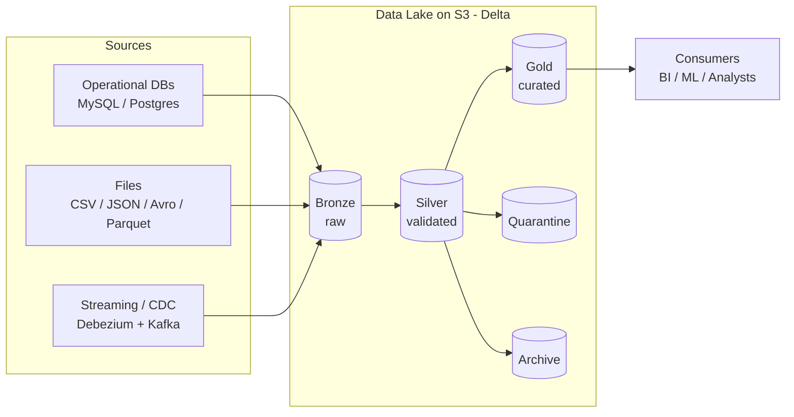
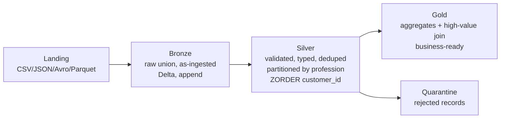

# Data Lake and Lakehouse Architecture

This document is the primary deliverable for task 09 (the task's outcome is
"Diagrams, documentation"). It captures the requirements analysis and the design
decisions for a medallion lakehouse, and explains how the architecture satisfies
the three hard requirements in the task. The companion `lakehouse.py` builds and
demonstrates this design end to end.

## Platform note: Databricks -> open-source equivalent

The task is written for Databricks. We implement the identical concepts on the
open-source stack we use throughout this section, so nothing is cloud-locked:

| Databricks feature | Our open-source equivalent |
|---|---|
| Delta Lake (managed) | Delta Lake OSS (`delta-spark`) |
| DBFS / cloud storage | LocalStack S3 (`s3a://`) |
| Databricks Runtime / clusters | PySpark on the host (`local[*]`) |
| `OPTIMIZE` / `ZORDER` / `VACUUM` | Same commands in Delta OSS |
| Unity Catalog | Path-based tables + task 07's catalog index |

Every ACID, partitioning, clustering and lifecycle capability the task asks for
exists in Delta OSS, so the design transfers to Databricks unchanged.

## Requirements

### Functional
- Ingest data from multiple sources and formats (CSV, JSON, Avro, Parquet).
- Transform raw data through ETL into query-ready tables (aggregation, joins /
  merges, filtering).
- Validate data quality; isolate bad records.
- Serve curated tables for advanced analysis.
- Reflect source changes over time (CDC).

### Non-functional
- **Reliability / integrity:** ACID transactions; no partial writes; auditable
  history; the ability to undo bad changes.
- **Performance:** partitioning, clustering (Z-ordering) and file compaction for
  fast, cheap queries via data skipping.
- **Cost-effectiveness:** columnar storage (Parquet) with compression; lifecycle
  archiving and purging so cold data does not sit on hot storage.
- **Governance:** the right to delete individual records (GDPR), retention and
  purge policies.
- **Scalability:** object storage + Spark scale horizontally; layers are
  decoupled so each can grow independently.

## Communication and collaboration with external systems

- **Inbound:** batch files land in a landing zone; operational databases arrive
  via CDC (task 08's Debezium + Kafka pattern) or batch extracts. All inbound
  data first lands in **bronze** unchanged, so ingestion is decoupled from
  processing and always replayable.
- **Outbound:** consumers (BI tools, ML jobs, analysts) read only **gold** (and
  sometimes silver), never the raw sources. This isolates external systems from
  upstream schema churn.
- **Contracts:** each layer boundary is a schema contract. Producers can change
  as long as bronze ingestion still parses; consumers only depend on gold.

## The medallion layers

- **Bronze (raw):** the union of every source in every format, stored as-is in
  Delta with an ingestion timestamp. Purpose: a durable, replayable landing
  record. No business logic.
- **Silver (validated):** typed, deduplicated, quality-checked. Validation rules:
  `customer_id` present, `0 < age < 120`, `annual_income >= 0`, non-blank
  `profession`; duplicates on `customer_id` removed. Rejected rows go to a
  **quarantine** table (not dropped), so nothing is lost and failures are
  auditable. Silver is **partitioned by `profession`** and **Z-ordered by
  `customer_id`** for query performance.
- **Gold (curated):** business aggregates (per-profession customer counts,
  average income and spending) plus a filtered, joined "high-value customers"
  table. This is what analysts and dashboards consume.

## How the architecture meets the three hard requirements

1. **Frequently updated / GDPR-deletable data (sensitive customer info).**
   Delta gives row-level `UPDATE`, `MERGE` and `DELETE`. A GDPR "right to be
   forgotten" request is a single `DELETE` on silver (demonstrated in
   `demonstrate_acid`). Because Delta rewrites only affected files atomically,
   deletes are safe under concurrent reads, and `VACUUM` then physically purges
   the data so it is genuinely gone.

2. **Absolutely reliable data (financial transactions, chargebacks, fraud).**
   Delta is **ACID**: every write is all-or-nothing and serializable, so a
   cancelled transaction (a chargeback reversal) is applied via `MERGE` without
   ever exposing a partial state. The transaction log keeps full history, so a
   fraudulent or erroneous batch can be audited and rolled back (time travel /
   `RESTORE`, covered in task 11). No lost updates, no dirty reads.

3. **Reflecting source changes via CDC.**
   Source inserts/updates/deletes are captured with Debezium, streamed through
   Kafka, and `MERGE`d into the lakehouse incrementally (task 08). Bronze keeps
   the raw change feed; silver holds the current, deduplicated state. New changes
   flow through the same medallion path, so downstream gold tables always reflect
   the latest source reality.

## Optimization, lifecycle and governance

- **Storage / compression:** all Delta data is Parquet with Snappy compression
  (columnar + compressed = cheap and fast). Small streaming files are compacted
  with `OPTIMIZE`.
- **Partitioning / clustering / indexing:** silver is partitioned by
  `profession` (partition pruning) and Z-ordered by `customer_id` (data skipping
  via file statistics) - the lakehouse equivalent of an index for range/point
  lookups.
- **Lifecycle:** cold rows are archived to a separate `archive/` tier, and
  `VACUUM` purges files no longer referenced by the log (retention / purge). This
  mirrors task 06's retention engine.
- **Data quality / validation:** the bronze-to-silver step enforces the rules
  above and quarantines violations, so gold is trustworthy by construction.

## Advanced analysis

On the curated tables we run windowed analytics - for example the top-N spenders
per profession using `ROW_NUMBER() OVER (PARTITION BY profession ORDER BY
spending_score DESC)` - the kind of query the gold layer exists to serve.
